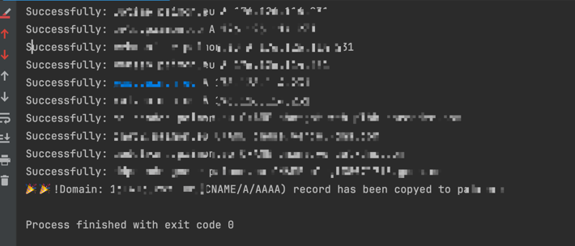

## Cloudflare DNS记录和Origin Rules迁移脚本


### 使用方法
- 你需要安装python3环境
- 下载cftools.py
- 修改脚本内最下面的参数
- 执行 python3 cftools.py

```python

# 如果都在域名都在一个账号下，源email 和目标email apikey需要填写一样的
migrator = CloudflareMigrator('源cf账号email', '源cf apikey', '需要迁移的域名',
                                  '目标cf账号email', '目标cf apiKey', '目标域名')
    
# 迁移dns记录
migrator.migrate_dns_records()

# 迁移origin rules
migrator.migrate_origin_rules()

# 以下方法请慎用
# 删除源账号下 指定域名的dns记录
# migrator.purge_target_account_dns()
# 删除目标账号下 指定域名的dns记录
# migrator.purge_target_account_dns()


```
### 效果如下
